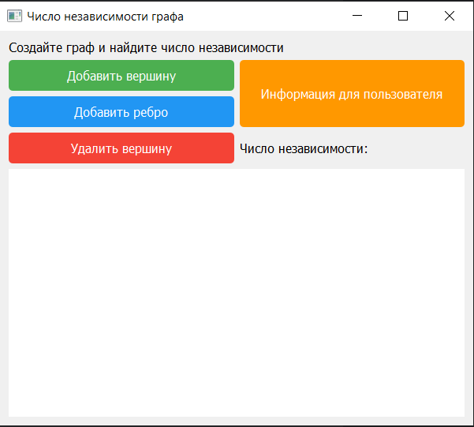
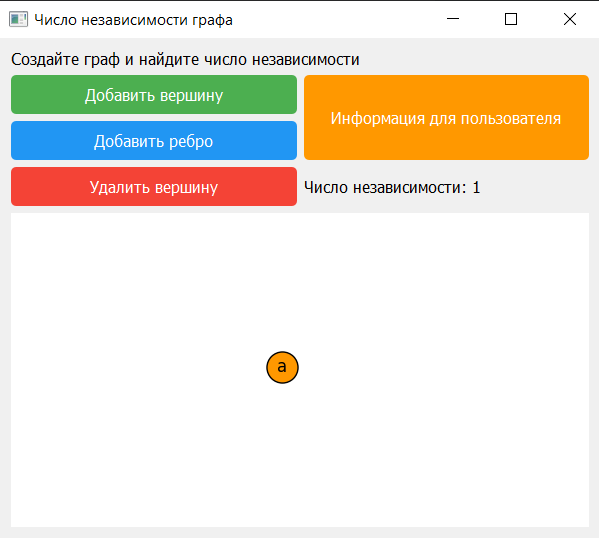
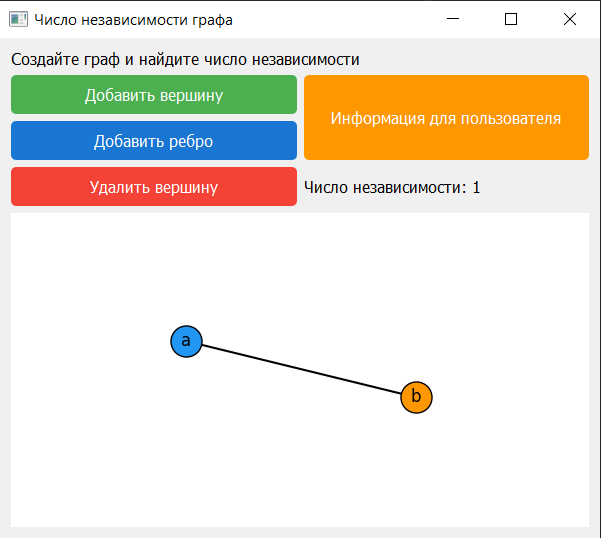
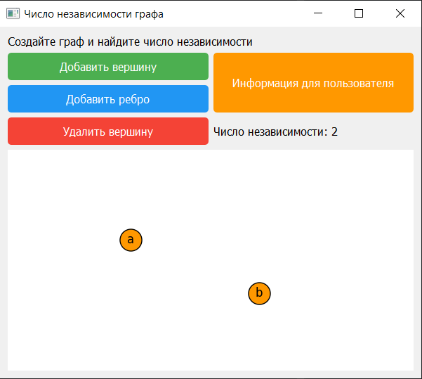
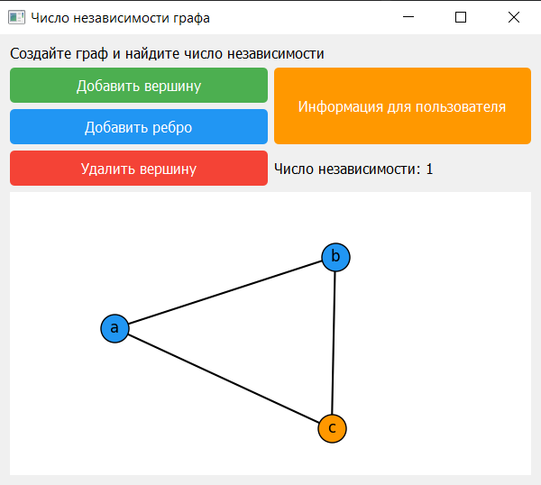
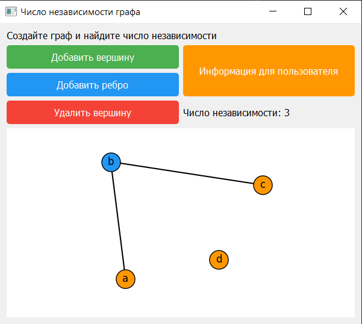
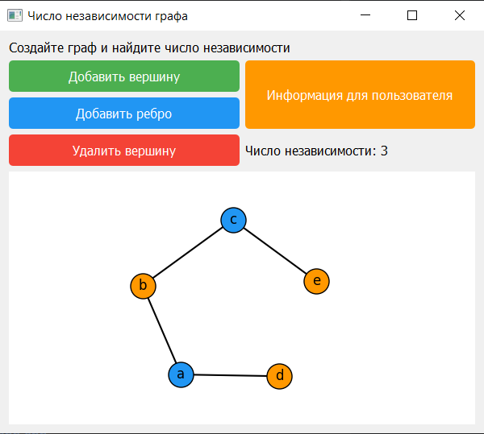
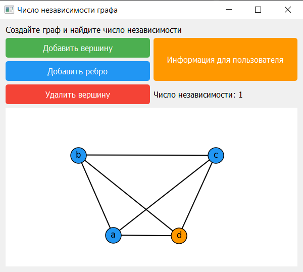
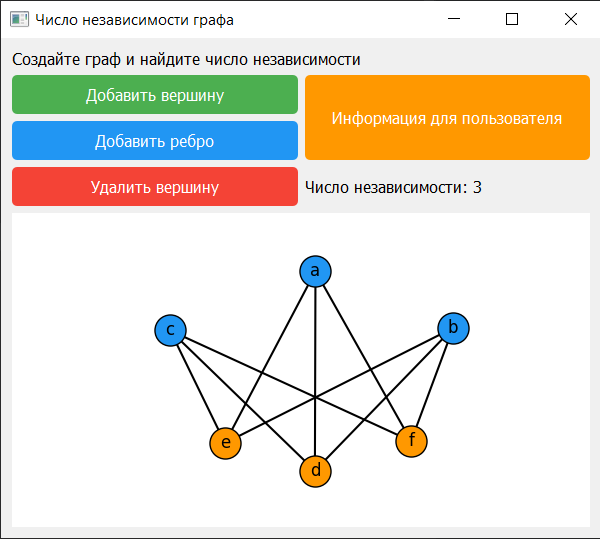
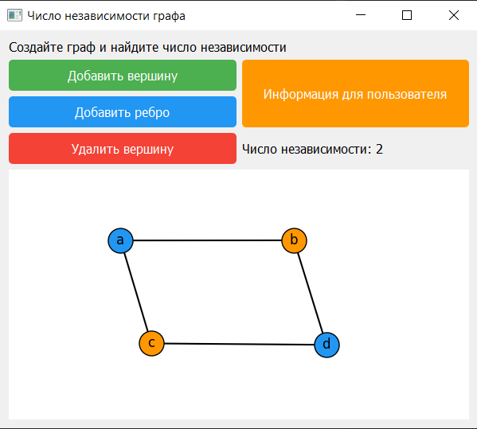

# Курсовая работа

## Описание
Основной целью данной курсовой работы была реализация UI-интерфейса 
для взаимодействия с алгоритмом нахождения числа независимости графа.
В качестве реализации поставленной задачи был выбран язык программирования
Python версии 3.12.7 (в частности был использован фреймворк PyQt с сопутствующими
ему библиотеками).

## Реализованный функционал
- Добавление вершины графа
- Удаление вершины графа
- Добавление грани
- Автоматический подсчет числа независимости графа
- Графическое выделение независимых вершин графа
- Возможность перетаскивания вершин графа по полю

## Запуск проекта
Предварительно установите на ПК python версии >= 3.10.x, после чего откройте терминал 
в корневой директории проекта
```commandline
# установка библиотек и зависимостей проекта
pip install -r requirements.txt

# перейдите в директорию с исходным кодом src
cd src

# запустите сборку параллельного алгоритма поиска числа независимости графа
# после сборки появится папка build и собранный файл independence_graph.pyd
python setup.py clean
python setup.py build_ext --inplace

# запуск проекта
python main.py
```

## Предварительный просмотр











